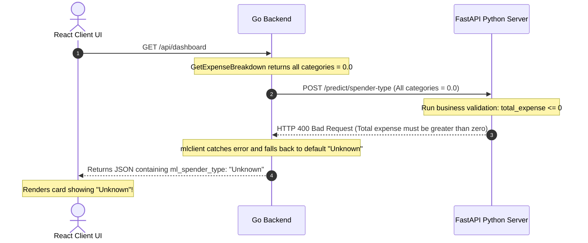

# Walkthrough: AI Spending Behavior "Unknown" Remediation

This document explains the technical root cause of why the **AI Spending Behavior** card displays `"Unknown"` upon initial login/signup (when the user has no transaction history) and outlines the clean architectural solutions to resolve it.

---

## 🔍 The Potential Error (Detailed Diagnosis)

When a user first launches the dashboard, their account has **zero expenses**. The application attempts to calculate their spending behavior by chaining the React Frontend, Go Backend, and FastAPI Python ML Server:



---

### 1. The FastAPI ML Server Block (`api.py`)
In your Python ML microservice `/Users/dhrubajitchakravarty/Documents/Project/Zenora/Zenora-web/personal-finance-ml/src/api.py`, the `/predict/spender-type` endpoint enforces a strict business check:

```python
    # Business Validation :
    total_expense = (
        data.food_and_drink + 
        data.rent + 
        data.utilities + 
        data.entertainment + 
        data.travel + 
        data.health_and_fitness + 
        data.shopping + 
        data.other 
    ) 
    if total_expense <= 0: 
        raise HTTPException(
            status_code=status.HTTP_400_BAD_REQUEST, 
            detail="Total expense must be greater than zero."
        )
```
Since a new user has `total_expense = 0.0`, the FastAPI server rejects the request with an **HTTP 400 Bad Request**.

---

### 2. The Go Backend Silent Fallback (`service.go`)
In your Go backend `/Users/dhrubajitchakravarty/Documents/Project/Zenora/Zenora-web/personal-finance-backend/internal/dashboard/service.go`, the dashboard data getter defaults `spenderType` to `"Unknown"` and suppresses any API error:

```go
	// 0.0 values naturally feed successfully if categories are empty.
	spenderType := "Unknown"
	mlResult, mlErr := mlclient.PredictSpender(input)
	if mlErr == nil && mlResult != nil {
		spenderType = mlResult.SpenderType
	}
```
Because the ML client returns an error (due to the HTTP 400), `spenderType` remains `"Unknown"`, which is returned to the React frontend. In the React UI, `"Unknown"` is rendered directly, which looks like a database or system failure.

---

## 🛠️ The Architectural Solutions

To fix this, we can apply two complementary updates:

### Solution Option A: Go Backend Early-Bypass & Premium Default (*Recommended*)
Instead of making an unnecessary HTTP request from Go to Python when we already know the user has no expenses, the Go backend should detect `TotalExpenses == 0` early.
* **Why**: Avoids slow HTTP handshakes on empty dashboards and presents a premium `"Analyzing..."` status (styled in slate blue) instead of `"Unknown"`.

#### Implementation Plan (`service.go`):
```go
	spenderType := "Analyzing..." // ⚡ Default to premium status
	
	// Only query Python ML Server if user has recorded expenses!
	if metrics["total_expenses"] > 0 {
		mlResult, mlErr := mlclient.PredictSpender(input)
		if mlErr == nil && mlResult != nil {
			spenderType = mlResult.SpenderType
		} else {
			spenderType = "Analyzing..." // Safe fallback on error
		}
	}
```

---

### Solution Option B: Graceful FastAPI Response on Zero Expenses
Alternatively, the Python ML server can handle empty profiles gracefully instead of throwing a harsh HTTP 400 error.

#### Implementation Plan (`api.py`):
```python
    if total_expense <= 0:
        return {
            "status": "success",
            "data": {
                "spender_type": "Analyzing..." # ⚡ Return clean analysis state
            },
            "error": None
        }
```

---

## 📈 Expected Outcomes
* **Zero Overhead**: Eliminates network calls between Go and Python for new signups.
* **Premium UX**: New users immediately see a gorgeous slate-blue `"Analyzing..."` card on their dashboard which transitions automatically to `"Saver"`, `"Balanced"`, or `"High Spender"` as soon as they record their first expense.
