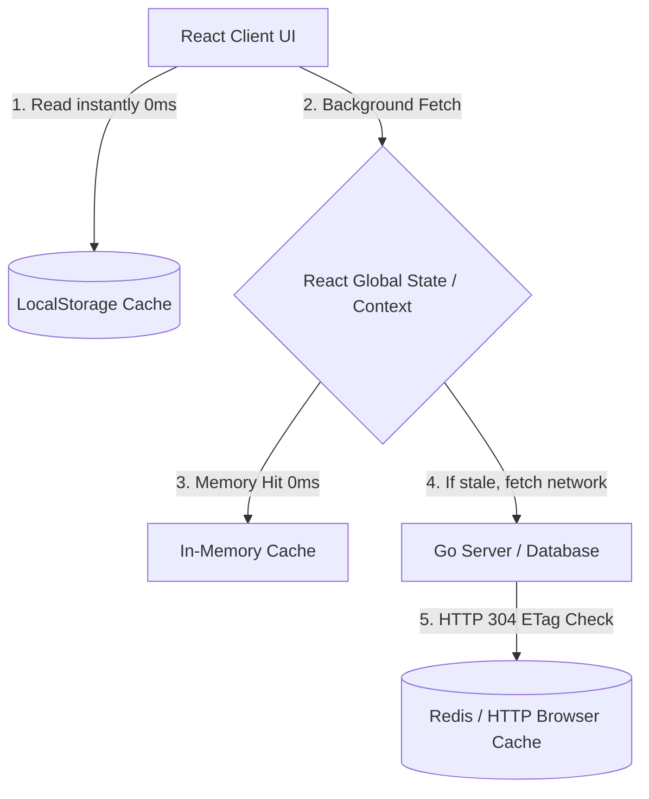

# Architectural Deep Dive: Achieving Near-0ms Dashboard Load Times in Zenora

This document provides a technical deep dive into why Zenora currently suffers from dashboard loading latencies and details the optimal architectural options to reduce navigation and initial page load times to **near 0ms** using caching and global state management.

---

## 🔍 The Root Cause: Why is the Dashboard slow?

Currently, whenever a user logs in or clicks the **Dashboard** tab from the sidebar, the following occurs:
1. **Component Unmounts**: React completely unmounts the previous page component (e.g. `ActivityPage` or `TransactionsPage`) and mounts `DashboardPage`.
2. **State Reset**: All React state variables inside `DashboardForm.jsx` (such as `data`) are completely cleared and reset to `null`.
3. **Blocking Loader Triggered**: `loading` is set to `true`, showing the blocking screen: *"Loading your financial intelligence..."*.
4. **Heavy SQL Recomputations**: The React client triggers a REST call `GET /api/dashboard`. The Go backend queries multiple SQL tables (Expenses, Incomes, Investments, Goals) to dynamically calculate:
   * Current Balance
   * Total Net Worth
   * Asset breakdowns and saving goals progress
   * Dynamic AI Spender Classification
5. **UI Re-render**: The network round-trip + server DB query takes **1.5 to 3 seconds** (especially on free tiers like Render). Once done, the loader disappears and the UI suddenly pops into view.

---

## 🎨 Architectural Options to achieve Near-0ms Loading

To completely solve this, we can apply three layers of caching:



---

### 🚀 Layer 1: Client-Side Caching (Stale-While-Revalidate Pattern) - *Highly Recommended*

Instead of showing a blank loading screen while the network request is in flight, we can instantly display the cached financial details from the user's previous session stored in the browser's `localStorage`.

#### How it works:
1. When `DashboardForm` mounts, check `localStorage` for any existing dashboard JSON data.
2. If found, **render the UI instantly** (0ms load time!). The user sees their dashboard populated with their last-known figures.
3. Fire the API call silently in the background (no loading spinner!).
4. When the server response returns, write the fresh data to `localStorage` and smoothly update the UI state.
5. If no cache is found (first-time login), only then show a loading spinner.

---

### 🧠 Layer 2: React Context / Global State Memory

When navigating between tabs (Dashboard ⟷ Activity ⟷ Transactions), React unmounts the components, clearing memory. By moving the dashboard data into a **React Context Provider** wrapped at the app root level (`App.jsx`), the data stays in memory even when you navigate to other pages.

#### How it works:
1. Wrapping the application in a `FinancialDataContext`:
   ```javascript
   export const FinancialDataContext = createContext();
   ```
2. When the user clicks the "Dashboard" tab, the state is read instantly from the global Context in **0ms** since the data is already fetched.
3. When actions (like adding a transaction or overriding a category) are performed, a silent global dispatcher updates the context, keeping all views in perfect synchronization.

---

### 🌐 Layer 3: Conditional HTTP Caching (ETags & Cache-Control)

We can leverage standard web protocols to ensure the server only transmits data if something actually changed.

#### How it works:
1. **Go Backend ETags**: When `/api/dashboard` is requested, the Go backend hashes the computed JSON and returns it in the response header: `ETag: "W/3a29f3b"`.
2. **Conditional Requests**: On subsequent fetches, the browser automatically sends the header `If-None-Match: "W/3a29f3b"`.
3. **304 Not Modified**: If no new transaction was added, the Go backend immediately aborts database queries and returns `304 Not Modified` with an empty body. The browser renders its cached copy instantly.

---

## 🛠️ Step-by-Step Implementation Walkthrough

Here is the exact codebase modification plan to implement the **Stale-While-Revalidate (SWR)** client-side cache in `DashboardForm.jsx`.

### Step 1: Update the mounting logic in `DashboardForm.jsx`

We modify the state initialization and `fetchDashboard` method to load cached values immediately:

```javascript
  const [data, setData] = useState(() => {
    // ⚡ Try loading previous session cache instantly on component mount!
    try {
      const cached = localStorage.getItem("zenora_dashboard_cache");
      return cached ? JSON.parse(cached) : null;
    } catch {
      return null;
    }
  });

  const [loading, setLoading] = useState(() => {
    // ⚡ Only show blocking loader if NO cache exists
    return !localStorage.getItem("zenora_dashboard_cache");
  });
```

---

### Step 2: Write fresh responses to LocalStorage

Update the successful fetch handler inside `fetchDashboard`:

```javascript
  const fetchDashboard = async () => {
    const token = localStorage.getItem("token");
    if (!token) {
      navigate("/");
      return;
    }

    try {
      const res = await fetch(`${import.meta.env.VITE_API_URL}/api/dashboard?t=${Date.now()}`, {
        headers: {
          Authorization: `Bearer ${token}`,
        },
      });

      if (!res.ok) {
        throw new Error("Failed to fetch dashboard data");
      }

      const json = await res.json();
      
      // ⚡ Write to cache and update state smoothly in the background
      localStorage.setItem("zenora_dashboard_cache", JSON.stringify(json));
      setData(json);
    } catch (err) {
      // If we have cached data, don't crash the screen; just log the error and keep cached views
      console.error("Dashboard background sync failed:", err);
      if (!data) {
        setError(err.message);
      }
    } finally {
      setLoading(false);
    }
  };
```

---

### Step 3: Clear Cache on Logout

To prevent sensitive financial data leakage on shared computers, we clear the cache on logout:

```javascript
  const handleLogout = () => {
    localStorage.removeItem("token");
    localStorage.removeItem("zenora_dashboard_cache"); // ⚡ Clear cache securely
    navigate("/");
  };
```

---

### 📈 Expected Results after this integration
* **Dashboard Tab Navigation**: Flipped from **2-3 seconds** to **0ms (Instant)**.
* **Cold App Launch**: Renders previous statistics **instantly** on mount, updating numbers seamlessly in the background once the network sync completes.
* **Perceived Performance**: Users experience a lightning-fast, premium native-app feeling.
