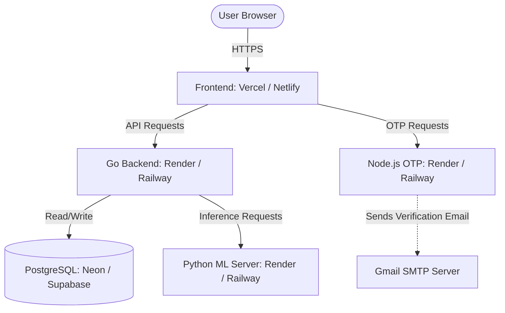

# 🌐 Zenora: Complete Cloud Deployment & Hosting Guide

This guide walks you through deploying the entire Zenora ecosystem—including the PostgreSQL database, GoLang REST API, Node.js OTP server, Python Machine Learning service, and React frontend—to secure, scalable cloud hosting environments, completely free of charge.

---

## 🏗️ Architecture Overview

The deployed system interacts securely across the cloud:



---

> [!NOTE]
> **PostgreSQL Database:** Since your database is already fully set up and configured on Neon with all the required tables, you do not need to create or run any SQL setup scripts! Just make sure you have your database **Connection String** (`DATABASE_URL`) ready to connect to your Go backend in the following steps.

---

## 🧠 Step 2: Deploy the Python ML Service (Render)

The machine learning service (`personal-finance-ml`) is built with FastAPI. We can host it on [Render](https://render.com) as a free Web Service.

### 1. Create a `requirements.txt`
In the `personal-finance-ml` directory, ensure you have a `requirements.txt` containing the necessary dependencies:

```text
fastapi==0.110.0
uvicorn==0.28.0
pydantic==2.6.4
pandas==2.2.1
scikit-learn==1.4.1.post1
transformers==4.38.2
torch==2.2.1
```

### 2. Configure Render Web Service
1. Log in to [Render](https://render.com) and click **New +** > **Web Service**.
2. Connect your Git repository.
3. Set the following options:
   * **Name:** `zenora-ml`
   * **Runtime:** `Python 3`
   * **Root Directory:** `personal-finance-ml`
   * **Build Command:** `pip install -r requirements.txt`
   * **Start Command:** `uvicorn src.api:app --host 0.0.0.0 --port $PORT`
4. Click **Deploy Web Service** and save your deployed URL (e.g. `https://zenora-ml.onrender.com`).

---

## ✉️ Step 3: Deploy the Node.js OTP Service (Render)

The Node.js server (`backend` directory) handles mail-out verifications.

### 1. Configure Render Web Service
1. In the Render Dashboard, click **New +** > **Web Service**.
2. Connect your Git repository.
3. Configure the service:
   * **Name:** `zenora-otp`
   * **Runtime:** `Node`
   * **Root Directory:** `backend`
   * **Build Command:** `npm install`
   * **Start Command:** `node server.js`
4. In the **Environment** tab, click **Add Environment Variable** and enter:
   * `EMAIL_USER`: *Your Google Gmail address*
   * `EMAIL_PASS`: *Your Google Gmail App Password* (generated in Google Account > Security > App Passwords)
5. Deploy and copy the deployed URL (e.g. `https://zenora-otp.onrender.com`).

---

## ⚙️ Step 4: Deploy the GoLang REST API (Render)

The core API server (`personal-finance-backend`) handles JWT tokens, transactional data routing, and acts as the gatekeeper.

### 1. Configure Render Web Service
1. Click **New +** > **Web Service**.
2. Connect your Git repository.
3. Configure the service:
   * **Name:** `zenora-api`
   * **Runtime:** `Go`
   * **Root Directory:** `personal-finance-backend`
   * **Build Command:** `go build -o server cmd/server/main.go`
   * **Start Command:** `./server`
4. Go to the **Environment** tab and add:
   * `DATABASE_URL`: *Your Neon connection string*
   * `ML_SERVER_URL`: *Your deployed Python ML server URL* (e.g. `https://zenora-ml.onrender.com`)
   * `JWT_SECRET`: *A secure random string (e.g., `8f7b5a2e9c1d4f6b0a8e7d5c3b1a9f0e`)*
5. Deploy and save the API URL (e.g. `https://zenora-api.onrender.com`).

---

## 💻 Step 5: Connecting the React Frontend to the Cloud

Rather than hardcoding cloud URLs directly into component files, the industry best practice is using **Vite Environment Variables**. This makes switching between local development and cloud production automatic!

### 1. Set Up Environment Config Files
In the `frontend` root directory, create a `.env.production` file:

```env
VITE_API_URL=https://zenora-api.onrender.com
VITE_OTP_URL=https://zenora-otp.onrender.com
VITE_ML_URL=https://zenora-ml.onrender.com
```

Create a `.env.development` file for local testing:

```env
VITE_API_URL=http://localhost:8080
VITE_OTP_URL=http://localhost:5050
VITE_ML_URL=http://localhost:5000
```

### 2. Update React Code to Reference Env Variables
Replace all hardcoded localhost fetch requests with dynamic environment endpoints:

#### In `LoginForm.jsx`:
```javascript
// Send OTP via Node server
const res = await fetch(`${import.meta.env.VITE_OTP_URL}/send-otp`, { ... })

// Verify OTP
const verifyRes = await fetch(`${import.meta.env.VITE_OTP_URL}/verify-otp`, { ... })

// Fetch Token from Go backend
const loginRes = await fetch(`${import.meta.env.VITE_API_URL}/auth/otp-login`, { ... })
```

#### In `DashboardForm.jsx`, `ActivityPage.jsx`, `TransactionsPage.jsx`:
Replace all instances of `"http://localhost:8080"` with `` `${import.meta.env.VITE_API_URL}` ``.

---

## 🖥️ Step 6: Configure Environment Variables in Your Deployed Vercel Project

Since your frontend is already hosted on Vercel, you do not need to create a new project! You just need to link your existing Vercel deployment to your newly hosted cloud backends by adding the environment variables in your Vercel project dashboard:

### 1. Add Environment Variables on Vercel
1. Go to your [Vercel Dashboard](https://vercel.com) and click on your **Zenora** project.
2. Navigate to **Settings** > **Environment Variables** in the top menu.
3. Add the following three environment variables under the **Production** environment:
   * **Key:** `VITE_API_URL` ➜ **Value:** `https://zenora-api.onrender.com` (Your Go Backend Cloud URL)
   * **Key:** `VITE_OTP_URL` ➜ **Value:** `https://zenora-otp.onrender.com` (Your Node OTP Server Cloud URL)
   * **Key:** `VITE_ML_URL` ➜ **Value:** `https://zenora-ml.onrender.com` (Your Python ML Server Cloud URL)
4. Click **Save**.

### 2. Trigger a Redeploy
1. Go to the **Deployments** tab of your project in Vercel.
2. Locate your latest deployment, click the three dots (`...`), and select **Redeploy**.
3. Vercel will rebuild your React app using Vite, compile the new cloud endpoints, and serve your live Zenora application globally connected to the cloud!
