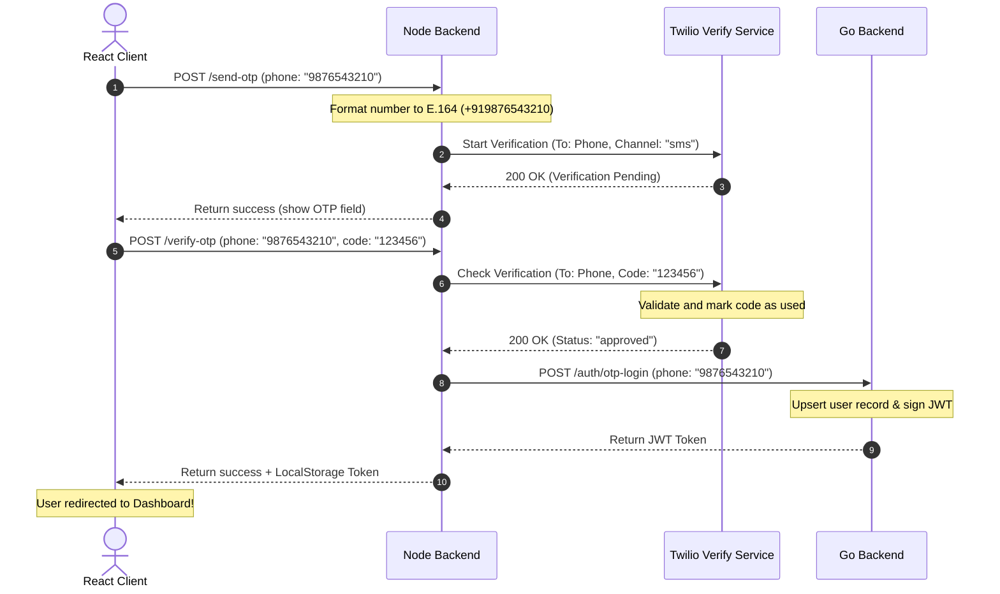

# Mobile OTP Integration & Setup Guide

This document outlines the recommended SMS gateways, technical architecture, cost comparison, and implementation steps required to integrate a secure Mobile SMS OTP verification system into **Zenora**.

---

## 📊 Gateway Comparison: Which one should Zenora use?

To implement Mobile OTP, we need a reliable SMS gateway. Below are the three best options tailored for a fintech platform:

| Gateway | Best For | Cost (India / Global) | Pros | Cons |
| :--- | :--- | :--- | :--- | :--- |
| **Twilio Verify API** | Global scaling & extreme reliability | ~₹3.50 / $0.05 per successful verification | • Handles OTP generation, storage, and 10-minute expiry automatically.<br>• Native fraud protection and carrier optimization. | • Expensive for high-volume Indian traffic.<br>• Requires international billing. |
| **Fast2SMS / MSG91** | Cost optimization in India | ~₹0.18 / $0.0022 per SMS | • Extremely cost-effective for Indian numbers.<br>• Simple REST API integration.<br>• DLT registration support. | • Requires manual OTP generation, storage (Redis/DB), and expiration logic on Node server. |
| **Firebase Phone Auth** | Zero-cost MVP & rapid development | **Free** (Up to 10k/month), then standard billing | • Completely free tier.<br>• Direct client-side SDK integration.<br>• No server-side OTP storage required. | • Requires client-side reCAPTCHA (can interrupt the frictionless look).<br>• Vendor lock-in to Firebase. |

> [!TIP]
> **Recommendation**: For Zenora, **Twilio Verify** is the recommended route if you target a premium global user base, as it offloads all OTP generation, hashing, rate-limiting, and timing logic from your server. If you are starting out with a focus on India and want the lowest cost, **Fast2SMS** is the best alternative.

---

## 🛠️ Architecture: Twilio Verify Flow

Here is how the mobile verification sequence will look when integrating Twilio Verify API:



---

## 🚀 Step-by-Step Twilio Verify Setup Guide

### Step 1: Create a Twilio Account & Verify Service
1. Sign up for a [Twilio Console Account](https://www.twilio.com/console).
2. Go to the **Verify** section in the sidebar.
3. Click **Create Service**.
4. Set the **Friendly Name** to `Zenora`.
5. Note down your:
   * **Account SID** (e.g. `ACXXXXXXXXXXXXXXXXXXXXXXXXXXXXXXXX`)
   * **Auth Token** (e.g. `your_auth_token`)
   * **Verification Service SID (VA SID)** (e.g. `VAXXXXXXXXXXXXXXXXXXXXXXXXXXXXXXXX`)

---

### Step 2: Configure Backend Environment Variables
Update the `.env` file on your Node server (both local and Render) with your Twilio credentials:
```env
TWILIO_ACCOUNT_SID=ACXXXXXXXXXXXXXXXXXXXXXXXXXXXXXXXX
TWILIO_AUTH_TOKEN=your_auth_token
TWILIO_VERIFY_SERVICE_SID=VAXXXXXXXXXXXXXXXXXXXXXXXXXXXXXXXX
```

---

### Step 3: Install dependencies
Run this command in the `/backend` directory:
```bash
npm install twilio
```

---

### Step 4: Backend Integration (`server.js`)
We will expand the `/send-otp` and `/verify-otp` endpoints to check if the input is an email or a phone number, and route it to the appropriate service (Resend or Twilio):

```javascript
const twilio = require("twilio");

// Initialize Clients
const resend = new Resend(process.env.RESEND_API_KEY);
const twilioClient = twilio(process.env.TWILIO_ACCOUNT_SID, process.env.TWILIO_AUTH_TOKEN);
const TWILIO_SERVICE_SID = process.env.TWILIO_VERIFY_SERVICE_SID;

// Helper to check if string is email or phone
const isEmail = (val) => /^[^\s@]+@[^\s@]+\.[^\s@]+$/.test(val);
const isPhone = (val) => /^\d{10}$/.test(val);

// Send OTP Route
app.post("/send-otp", async (req, res) => {
  const { identifier } = req.body;
  if (!identifier) return res.status(400).json({ success: false, message: "Identifier is required" });

  const clean = identifier.trim();

  if (isEmail(clean)) {
    // 📧 ROUTE TO EMAIL (RESEND)
    const otp = Math.floor(100000 + Math.random() * 900000).toString();
    otpStore[clean] = { otp, expires: Date.now() + 5 * 60 * 1000 };

    try {
      const { error } = await resend.emails.send({
        from: "Zenora <otp@otp.zenoraapp.in>",
        to: clean,
        subject: "OTP Verification for Zenora",
        html: `<h2>Your OTP is: ${otp}</h2>`
      });
      if (error) return res.json({ success: false, message: error.message });
      return res.json({ success: true, method: "email" });
    } catch (err) {
      return res.json({ success: false, message: err.message });
    }
  } 
  
  if (isPhone(clean)) {
    // 📱 ROUTE TO SMS (TWILIO VERIFY)
    try {
      // Twilio Verify automatically generates and sends the SMS
      const verification = await twilioClient.verify.v2
        .services(TWILIO_SERVICE_SID)
        .verifications.create({ to: `+91${clean}`, channel: "sms" }); // Standardizes to Indian code +91
      
      return res.json({ success: true, method: "sms" });
    } catch (err) {
      console.error("Twilio SMS send error:", err);
      return res.json({ success: false, message: "Failed to send SMS OTP. Please try again." });
    }
  }

  return res.status(400).json({ success: false, message: "Invalid identifier format" });
});

// Verify OTP Route
app.post("/verify-otp", async (req, res) => {
  const { identifier, otp } = req.body;
  if (!identifier || !otp) return res.status(400).json({ verified: false });

  const clean = identifier.trim();
  const cleanOtp = otp.trim();

  if (isEmail(clean)) {
    // 📧 EMAIL VERIFICATION LOGIC
    if (otpStore[clean] && otpStore[clean].otp === cleanOtp && Date.now() < otpStore[clean].expires) {
      return res.json({ verified: true });
    }
    return res.json({ verified: false });
  }

  if (isPhone(clean)) {
    // 📱 SMS VERIFICATION LOGIC
    try {
      const verificationCheck = await twilioClient.verify.v2
        .services(TWILIO_SERVICE_SID)
        .verificationChecks.create({ to: `+91${clean}`, code: cleanOtp });
      
      return res.json({ verified: verificationCheck.status === "approved" });
    } catch (err) {
      console.error("Twilio verification check error:", err);
      return res.json({ verified: false });
    }
  }

  return res.json({ verified: false });
});
```

---

### Step 5: Frontend Integration (`LoginForm.jsx`)
We will remove the local `Mobile OTP logins are coming soon!` intercept in `LoginForm.jsx` so that a valid 10-digit mobile number proceeds directly to hit our new `/send-otp` service, triggering the SMS verification flow seamlessly.
